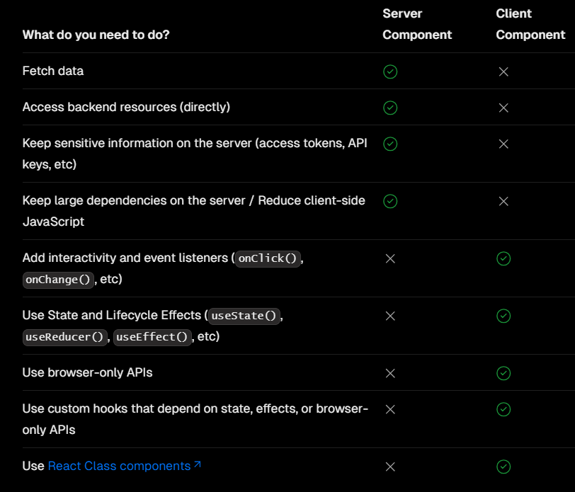

## Route Group

By applying paranthesis
Example: (course)

## Dynamic Route

[id]

## Catch All Routes

[...posts]

localhost:3000/blog/posts/himanshi

localhost:3000/blog/posts

Same page will render for both the routes

## Catch All Routes Optional

[[...posts]]

localhost:3000/blog

posts to be write in route is optional

## Parallel Routes or Conditional Routes Render

slots:

@left

@right

## Server Component and Client Component

@Server Component

React Server Components allow you to write UI that can be rendered and optionally cached on the server. In Next.js, the rendering work is further split by route segments to enable streaming and partial rendering, and there are three different server rendering strategies:

Static Rendering
Dynamic Rendering
Streaming

By default, Next.js uses Server Components. This allows you to automatically implement server rendering with no additional configuration, and you can opt into using Client Components when needed, see Client Components.

@Client Component

Client Components allow you to write interactive UI that can be rendered on the client at request time. In Next.js, client rendering is opt-in, meaning you have to explicitly decide what components React should render on the client.

There are a couple of benefits to doing the rendering work on the client, including:

Interactivity: Client Components can use state, effects, and event listeners, meaning they can provide immediate feedback to the user and update the UI.
Browser APIs: Client Components have access to browser APIs, like geolocation or localStorage, allowing you to build UI for specific use cases.

To use Client Components, you can add the React "use client" directive at the top of a file, above your imports.

"use client" is used to declare a boundary between a Server and Client Component modules. This means that by defining a "use client" in a file, all other modules imported into it, including child components, are considered part of the client bundle.

